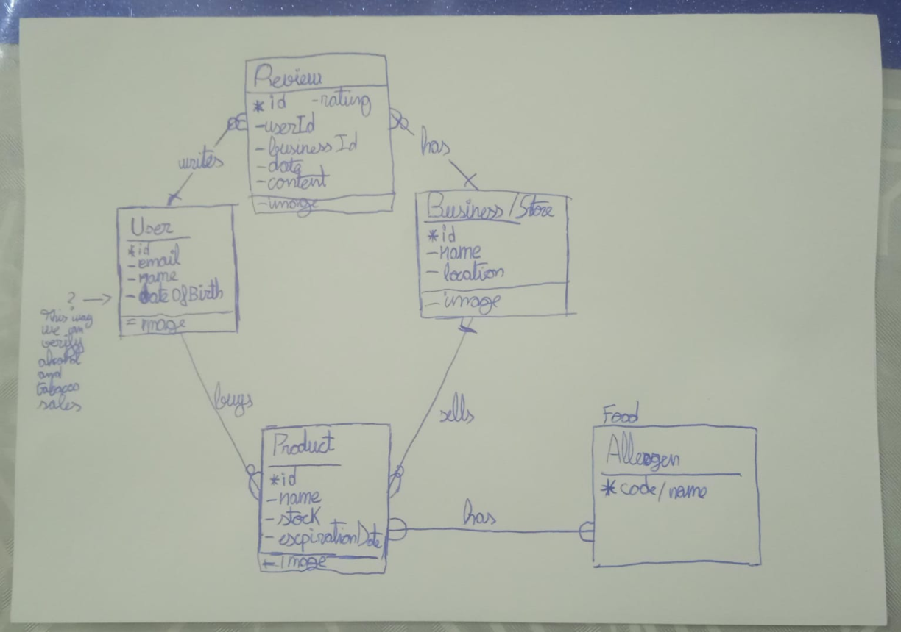
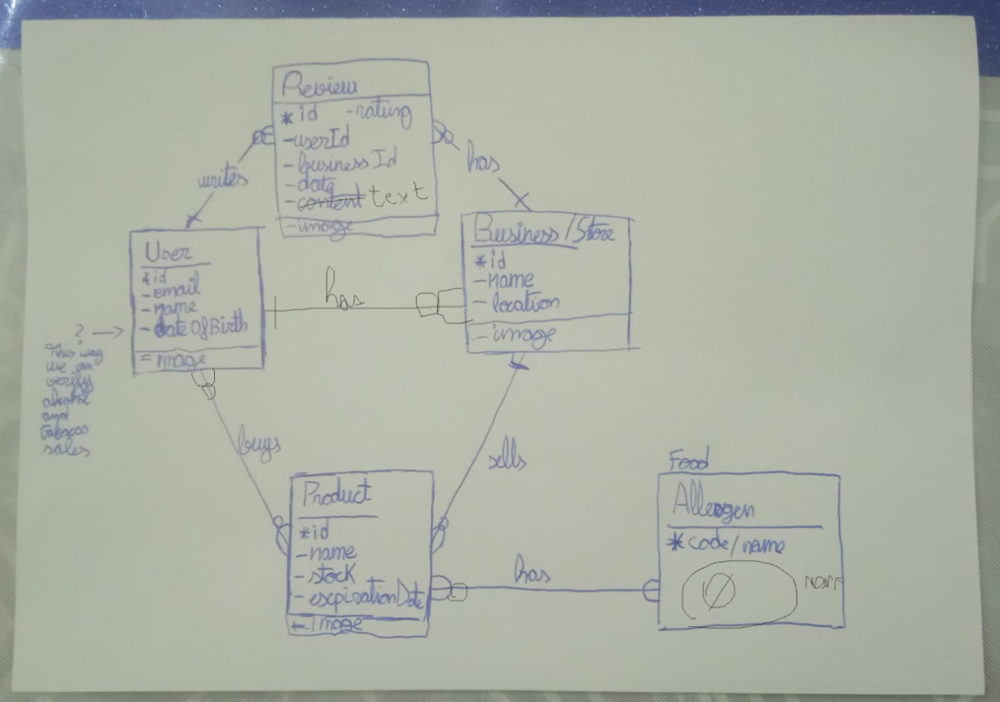

# References

Links and resources shared in our Discord server.

## \#general

### March 28th 2025

- [Gabriel](https://github.com/GabRodPul)
  - [Create T3 App](https://create.t3.gg/), our tech stack

### March 31st 2025

- [Gabriel](https://github.com/GabRodPul)
  - [Docker Desktop](https://docs.docker.com/desktop/), required by the T3 Stack

### April 2nd 2025

- [Gabriel](https://github.com/GabRodPul)
  - [T3 Stack docs](https://create.t3.gg/en/introduction)
  - [Allergen encyclopedia](https://www.thermofisher.com/phadia/wo/en/resources/allergen-encyclopedia.html), to look for codes and more info

## \#backend-🚀

### April 1st 2025

- [Gabriel](https://github.com/GabRodPul)
  - [Prisma docs](https://www.prisma.io/docs), our ORM

### April 2nd 2025

- [Gabriel](https://github.com/GabRodPul)
  - [Zod docs](https://zod.dev/?id=basic-usage), for input validation

## \#backend-🚀 -> database-💾

### March 28th 2025

- [Gabriel](https://github.com/GabRodPul)
  - [What is an Entity Relationship Model? How to Read Entity Relationship Diagrams & When to Use Them](https://www.youtube.com/watch?v=Oju_qQKN6i8)
  - 1st version of the E/R diagram: 

### April 1st 2025

- [Gabriel](https://github.com/GabRodPul)
  - 2nd version of the E/R diagram: 
